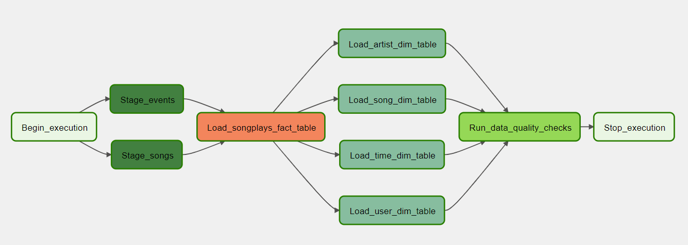
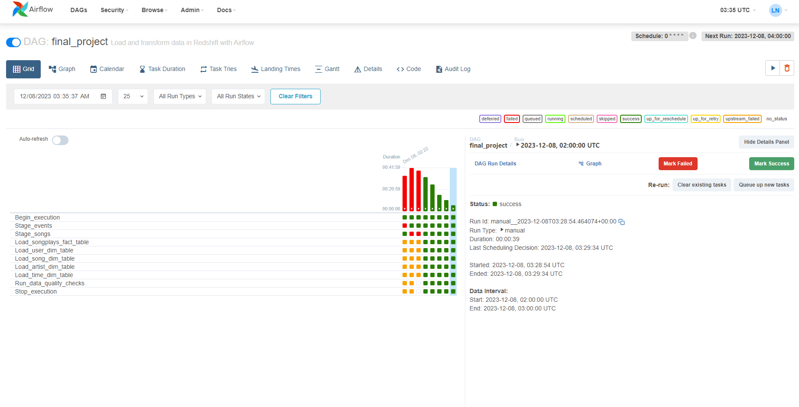
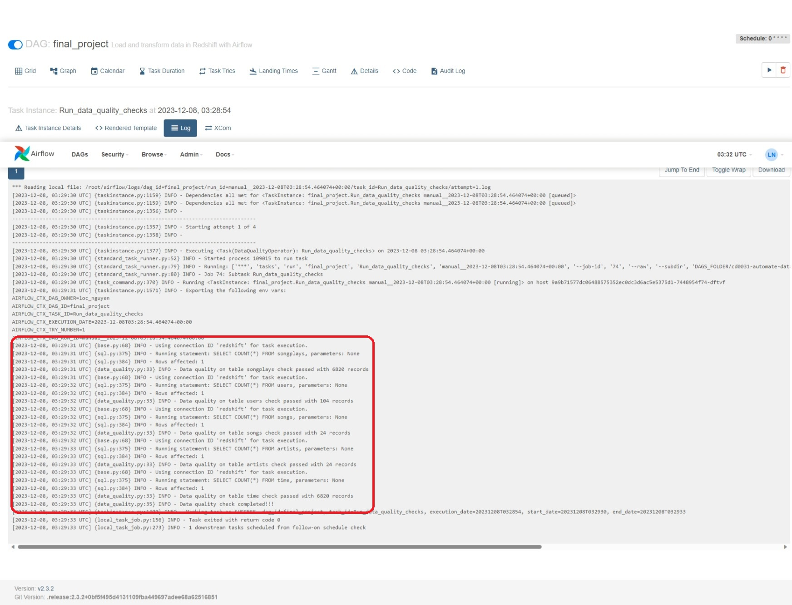

# Project: Data Pipelines with Airflow
by Loc Nguyen Dang

## Project Description
Sparkify, a music streaming company, wants to automate and monitor its data warehouse ETL pipelines using Apache Airflow. They require high-quality pipelines built from reusable tasks that are dynamic, monitorable, and allow easy backfilling. Data quality is crucial, so they want tests run against datasets after ETL steps to identify discrepancies. The data resides in S3 and needs processing in Sparkify's Amazon Redshift data warehouse. The source datasets are JSON logs of user activity and JSON metadata about songs.

## Project Structure
- `dags/final_etl_dag.py`: Specify the main pipeline, tasks, and their dependencies.
- `plugins/helpers/sql_queries.py`: SQL queries used to build the ETL pipeline
- `plugins/operators/stage_redshift.py`: Staging operator to copy JSON data from S3 to tables in Redshift
- `plugins/operators/load_fact.py`: Operator to loads data from staging to fact table
- `plugins/operators/load_dimension.py`: Operator to loads data from staging to dim tables 
- `plugins/operators/data_quality.py`: Operator that runs data quality checks 

## Data pipeline
Here is the final DAG:

## Results
DAG running result:

After lots of effort, the final DAG was successfully executed! :D 

Data quality check:

